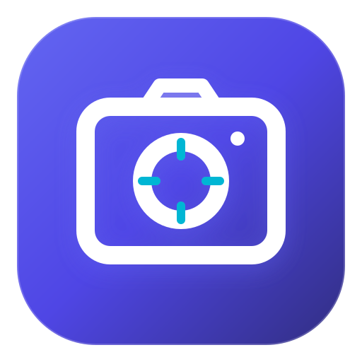

# 📸 PixelVault — Aplikasi Web Penyimpanan Foto Pribadi

  

  <strong>Platform penyimpanan foto pribadi terpusat, cepat, dan elegan tanpa hambatan autentikasi. Menjaga kualitas visual asli tanpa kompresi dengan kemudahan akses di semua perangkat.</strong>

  
  
  
  

---

## 📖 Tentang PixelVault

**PixelVault** lahir dari kebutuhan akan tempat penyimpanan dan pengelolaan koleksi foto pribadi yang praktis, cepat, dan aman dari penurunan kualitas gambar. Banyak platform galeri umum mengompresi foto secara berlebihan atau mewajibkan proses pendaftaran/login yang rumit. 

PixelVault menghilangkan seluruh hambatan tersebut:
- **Tanpa Sistem Login (*Zero-Friction Access*)**: Buka alamat situs dan Anda langsung masuk ke dasbor galeri pribadi tanpa perlu mengingat password atau akun.
- **Kualitas Asli Terjaga (*Original Resolution Guarantee*)**: Foto yang Anda simpan dapat diunduh kembali dengan resolusi piksel dan ukuran file yang persis sama seperti saat pertama kali diambil dari kamera perangkat Anda, tanpa kompresi tambahan.
- **Arsitektur Aset Ganda (*Dual-Asset Pipeline*)**: Sistem otomatis membuat thumbnail ringan untuk memastikan galeri dimuat secara instan dan mulus (*smooth lazy loading*), sementara berkas master beresolusi penuh tetap tersimpan utuh.

---

## ✨ Fitur-Fitur Unggulan Website

### 1. 📤 Upload Engine Fleksibel & Cepat
- **Drag-and-Drop Batch Upload**: Cukup seret beberapa foto sekaligus ke area unggah.
- **Clipboard Paste Langsung (`Ctrl + V`)**: Salin gambar dari internet atau ambil *screenshot* (`Win + Shift + S`), lalu tekan `Ctrl + V` di halaman PixelVault — foto akan otomatis masuk ke antrean unggah tanpa perlu disimpan ke disk terlebih dahulu!
- **Validasi Format Otomatis**: Mendukung format gambar standar: **JPEG, PNG, dan WebP**.
- **Indikator Real-Time**: Dilengkapi pratinjau thumbnail, info ukuran berkas, dan progress bar pemrosesan.
- **Tanpa Refresh Halaman**: Foto yang baru diunggah langsung disisipkan di urutan pertama galeri secara instan.

### 2. 🖼️ Mode Lightbox Imersif & Split-Screen Viewer
- **Tampilan Penuh Bebas Distorsi**: Pratinjau foto resolusi tinggi dengan latar belakang gelap elegan (*Dark Slate Vault*).
- **Alat Navigasi & Zoom**:
  - Tombol *Next* dan *Previous* di layar atau menggunakan tombol panah keyboard (`←` dan `→`).
  - Fitur perbesar (*Zoom In*), perkecil (*Zoom Out*), dan reset ukuran ke 100%.
  - Dukungan layar penuh (*Fullscreen mode*).
  - **Gestur Layar Sentuh (*Touch Swipe*)**: Di ponsel atau tablet, cukup geser jari ke kiri atau kanan untuk berpindah foto.

### 3. 💾 Unduh Resolusi Asli (Original Download)
- Tombol aksi utama yang menonjol di setiap foto memungkinkan Anda mengunduh master foto asli kapan saja dengan sekali klik, mengembalikan detail piksel penuh untuk kebutuhan cetak atau pengeditan profesional.

### 4. 🗂️ Pengelolaan & Metadata Foto
- Kelola judul dan deskripsi catatan untuk setiap momen foto.
- Kelompokkan foto berdasarkan **Album** pilihan Anda.
- Lihat spesifikasi teknis lengkap: format, resolusi piksel (misal *6000 × 4000*), ukuran berkas asli vs ukuran thumbnail, serta tanggal pengambilan foto.
- Hapus foto yang tidak diinginkan dengan aman.

### 5. 🔍 Pencarian Pintar & Pengurutan
- **Pencarian Cepat**: Temukan foto secara instan berdasarkan judul, nama berkas, deskripsi, atau nama album.
- **Pengurutan (Sort)**: Urutkan koleksi berdasarkan *Terbaru, Terlama, Nama (A-Z)*, atau *Ukuran File Terbesar*.

### 6. 📱 Dukungan PWA & Desktop App
- Website ini dapat dipasang sebagai **Aplikasi Desktop di Komputer (Windows/Mac)** dan **Ikon Beranda di Smartphone (Android/iOS)**.
- Berjalan di jendela tersendiri tanpa bilah URL browser, memberikan pengalaman selayaknya aplikasi native.

---

## 🛠️ Tumpukan Teknologi (Tech Stack)

Website ini dirancang secara modern tanpa *framework* berat untuk memaksimalkan kecepatan muat (*lightweight & blazingly fast*):

| Komponen | Teknologi | Deskripsi |
| :--- | :--- | :--- |
| **Markup** | HTML5 Semantik | Struktur konten aksesibel, ramah SEO, dan terorganisir. |
| **Gaya Desain** | Vanilla CSS3 | *Dark Vault Theme*, Glassmorphism, CSS Custom Properties, responsif multi-breakpoint. |
| **Logika Aplikasi** | Modern JavaScript (ES6+) | Penanganan event clipboard, manipulasi DOM real-time, touch gestures, state management lokal. |
| **Progressive Web App** | Service Worker & Web Manifest | Caching offline, splash screen, dan instalasi aplikasi desktop/mobile. |
| **Penyimpanan Lokal** | Browser Storage & Blob URL | Menyimpan data koleksi langsung di perangkat pengguna secara privat. |

---

## 📱 Responsif di Seluruh Perangkat

Website PixelVault telah diuji dan dioptimalkan untuk berbagai resolusi layar:
- 📱 **Mobile (< 540px)**: Tampilan galeri 2 kolom rapat bergaya galeri smartphone modern, drawer bawah responsif, dan kontrol ramah jempol.
- 📟 **Tablet (541px – 1024px)**: Tata letak 3–4 kolom yang lapang dengan adaptasi orientasi vertikal/horizontal.
- 💻 **Desktop & Laptop (> 1024px)**: Grid galeri lebar dengan hover micro-interactions dan mode split-view viewer di sebelah kiri serta panel detail di kanan.

---
