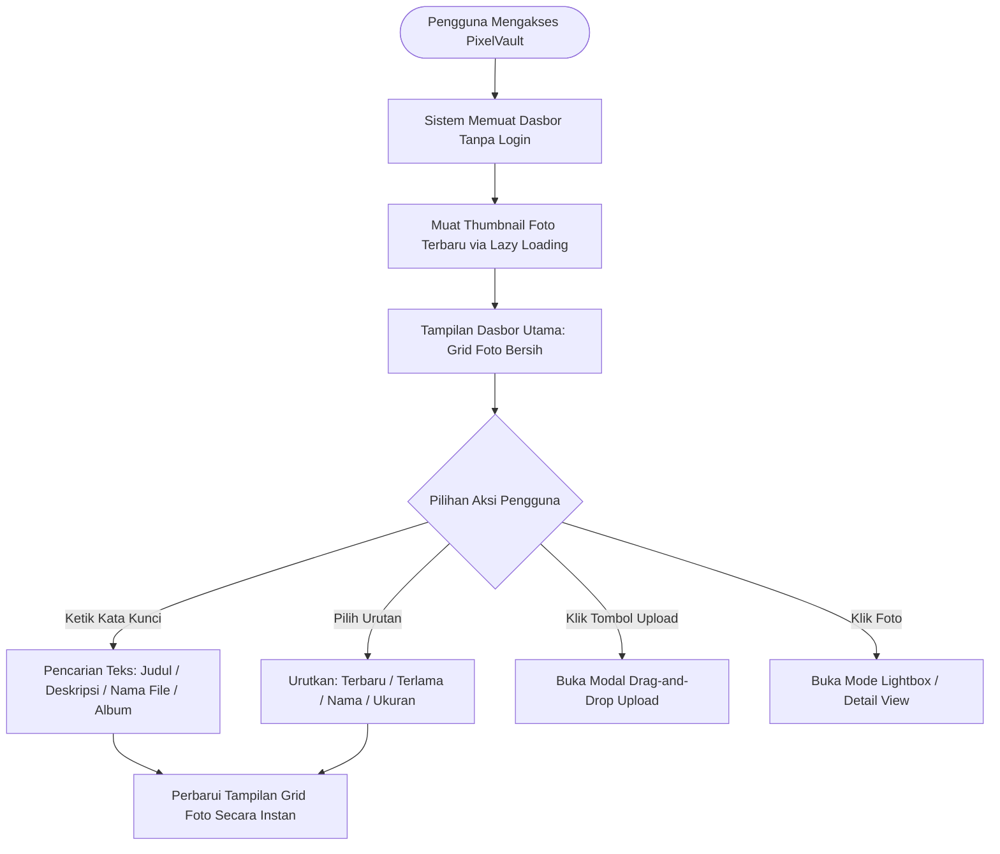
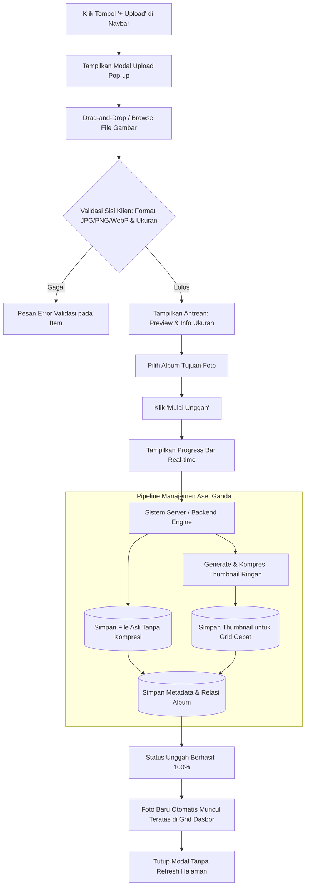
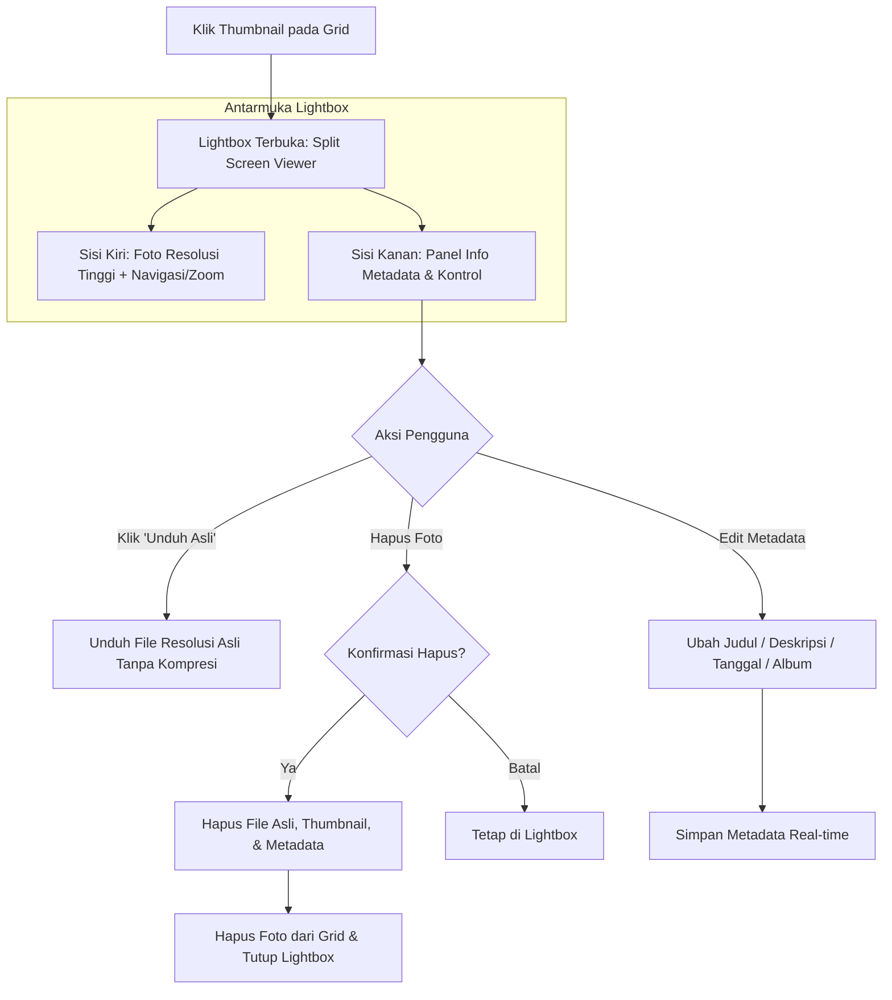

# PixelVault - Spesifikasi Wireframe UI/UX & Flowchart (Clean Layout)

Dokumen perancangan antarmuka (*wireframe*), arsitektur informasi, dan alur pengguna (*user flow*) untuk **PixelVault: Aplikasi Web Penyimpanan Foto Pribadi** dengan tata letak minimalis (**tanpa filter bar** dan **tanpa hashtag**).

---

## 1. Flowchart Arsitektur & Alur Pengguna (Mermaid)

### 1.1 Alur Utama: Akses, Eksplorasi, & Pencarian


### 1.2 Alur Sistem Unggah Foto (Upload Engine)


### 1.3 Alur Lightbox & Unduh Resolusi Asli


---

## 2. ASCII Wireframe: Tampilan Antarmuka Bersih (Clean Layout)

### 2.1 Wireframe 1: Dasbor Utama (Desktop View - Tanpa Filter & Hashtag)
```text
+========================================================================================================+
|  [P] PixelVault       |  [Q Cari foto, nama file, album...          ]         | [+ UPLOAD FOTO BARU]   |
+========================================================================================================+
|                                                                                                        |
|  (•) 142 Foto Tersimpan • 2.1 GB                                             Urutkan: [Terbaru v]      |
|--------------------------------------------------------------------------------------------------------|
|                                                                                                        |
|  +-----------------------+  +-----------------------+  +-----------------------+  +-----------------+  |
|  | [THUMBNAIL FOTO 1]    |  | [THUMBNAIL FOTO 2]    |  | [THUMBNAIL FOTO 3]    |  | [THUMBNAIL 4]   |  |
|  |                       |  |                       |  |                       |  |                 |  |
|  |   [HOVER STATE]       |  |                       |  |                       |  |                 |  |
|  |   (o) Pratinjau Cepat |  |                       |  |                       |  |                 |  |
|  |   (v) Unduh Asli      |  |                       |  |                       |  |                 |  |
|  |                       |  |                       |  |                       |  |                 |  |
|  | [4K RAW]   [14.2 MB]  |  | [JPG]        [3.8 MB] |  | [PNG]        [7.1 MB] |  | [WEBP]   [1.2MB]|  |
|  | Sunset Tanah Lot.jpg  |  | Gedung Sudirman.jpg   |  | Lembah Bromo.webp     |  | Bunga Anggrek   |  |
|  +-----------------------+  +-----------------------+  +-----------------------+  +-----------------+  |
|                                                                                                        |
|  +-----------------------+  +-----------------------+  +-----------------------+  +-----------------+  |
|  | [THUMBNAIL FOTO 5]    |  | [THUMBNAIL FOTO 6]    |  | [THUMBNAIL FOTO 7]    |  | [THUMBNAIL 8]   |  |
|  |                       |  |                       |  |                       |  |                 |  |
|  | [JPG]      [11.2 MB]  |  | [PNG]       [19.5 MB] |  | [JPG]        [5.0 MB] |  | [JPG]   [6.3 MB] |  |
|  | Kafe Sore Hari.jpg    |  | Pantai Pandawa.png    |  | Jalan Malioboro.jpg   |  | Studio Setup.jpg|  |
|  +-----------------------+  +-----------------------+  +-----------------------+  +-----------------+  |
|                                                                                                        |
|                                  [ v Memuat foto berikutnya... (Lazy Load) ]                           |
+========================================================================================================+
```

---

### 2.2 Wireframe 2: Modal Pop-up Upload Foto (Batch Drag-and-Drop)
```text
+-----------------------------------------------------------------------------------------------+
|  Unggah Foto ke PixelVault                                                                [X] |
+-----------------------------------------------------------------------------------------------+
|                                                                                               |
|   + - - - - - - - - - - - - - - - - - - - - - - - - - - - - - - - - - - - - - - - - - - - +   |
|   |                                                                                       |   |
|   |                                 [  (^) IKON CLOUD UPLOAD  ]                           |   |
|   |                                                                                       |   |
|   |                        Tarik & Lepaskan foto di sini (Drag & Drop)                    |   |
|   |                                                                                       |   |
|   |                             atau  [ Telusuri File dari Perangkat ]                    |   |
|   |                                                                                       |   |
|   |                     Mendukung format: JPG, PNG, WEBP (Bisa banyak file sekaligus)     |   |
|   + - - - - - - - - - - - - - - - - - - - - - - - - - - - - - - - - - - - - - - - - - - - +   |
|                                                                                               |
|  PILIH ALBUM TUJUAN: [ Liburan Bali 2024                                                    v ]|
|                                                                                               |
|  DAFTAR ANTREAN UNGGAH (3 File Terpilih):                                                     |
|  +-----------------------------------------------------------------------------------------+  |
|  | [img] DSC_0041_Raw.jpg  (14.8 MB)  [========================== 100% ] Berhasil       [v]|  |
|  | [img] Pantai_Pandawa.png (8.2 MB)  [===============>..........  60% ] Mengunggah...  [x]|  |
|  | [img] Panorama_Sunset.webp(3.1 MB) [..........................   0% ] Menunggu       [x]|  |
|  +-----------------------------------------------------------------------------------------+  |
|                                                                                               |
|  Total: 26.1 MB  |  Sistem otomatis membuat thumbnail optimal & menyimpan file asli utuh      |
|                                                                                               |
|                                              [ Batal ]    [ + MULAI UNGGAH SEMUA (3 FILE) ]   |
+-----------------------------------------------------------------------------------------------+
```

---

### 2.3 Wireframe 3: Lightbox & Detail Viewer (Split-Screen Desktop View)
```text
+===============================================================================================+
| [< Kembali ke Galeri]         PixelVault Lightbox Mode (Foto 1 dari 142)                  [X] |
+===================================================================+===========================+
|                                                                   | INFORMASI FOTO            |
|                                                                   |---------------------------|
|                                                                   | JUDUL FOTO:               |
|                                                                   | [ Sunset di Tanah Lot   ] |
|                                                                   |                           |
|        (<) PREV                                         NEXT (>)  | DESKRIPSI:                |
|                                                                   | [ Momen senja eksotis   ] |
|                                                                   | [ di pesisir barat Bali ] |
|                                                                   |                           |
|                     [ GAMBAR RESOLUSI UTAMA ]                     | ALBUM:                    |
|                                                                   | [ Liburan Bali 2024   v ] |
|                                                                   |---------------------------|
|                     (Tampilan Gambar Utama Bebas Distorsi         | SPESIFIKASI ASLI:         |
|                      Mendukung Zoom & Pan Layar Penuh)            | • Nama File : IMG_4821.JPG|
|                                                                   | • Resolusi  : 6000 x 4000 |
|                                                                   | • Asli      : 14.8 MB     |
|                                                                   | • Thumbnail : 145 KB      |
|                                                                   | • Diambil   : 14/08/2026  |
|                                                                   | • Format    : JPEG        |
|                                                                   |---------------------------|
|                                                                   | [ (v) UNDUH RESOLUSI ASLI |
|                                                                   |       (14.8 MB File Asli) ]
|                                                                   |                           |
|  Toolbar Bawah: [ (-) Zoom (+) ]  [ 100% ]  [ [ ] Layar Penuh ]   | [ [Hapus Foto]          ] |
+===================================================================+===========================+
```

---

### 2.4 Wireframe 4: Tampilan Seluler (Mobile Clean Layout)
```text
+------------------------------------+    +------------------------------------+
| [P] PixelVault            [+]      |    | [<-] Foto 1/142                [X] |
+------------------------------------+    +------------------------------------+
| [ Cari foto, album, file...      ] |    |                                    |
| 142 Foto Tersimpan • 2.1 GB        |    |                                    |
+------------------------------------+    |      [ GAMBAR RESOLUSI UTAMA ]     |
| +---------------+ +---------------+ |    |      (Swipe gesture kiri/kanan     |
| | [THUMBNAIL 1] | | [THUMBNAIL 2] | |    |       Pinch-to-zoom responsif)    |
| | 4K • 14.8 MB  | | JPG • 3.8 MB  | |    |                                    |
| | Sunset.jpg    | | Gedung.jpg    | |    +------------------------------------+
| +---------------+ +---------------+ |    | Sunset di Tanah Lot                |
| +---------------+ +---------------+ |    | Liburan Bali • 6000x4000 • 14.8 MB |
| | [THUMBNAIL 3] | | [THUMBNAIL 4] | |    +------------------------------------+
| | WEBP • 22.4MB | | JPG • 8.6 MB  | |    | [ (v) UNDUH RESOLUSI ASLI (14.8MB) ]|
| | Bromo.webp    | | Anggrek.jpg   | |    | [ Hapus Foto ]                     |
| +---------------+ +---------------+ |    +------------------------------------+
|        [ V Muat Lainnya ]          |    | (i) Info Metadata                  |
+------------------------------------+    +------------------------------------+
```
